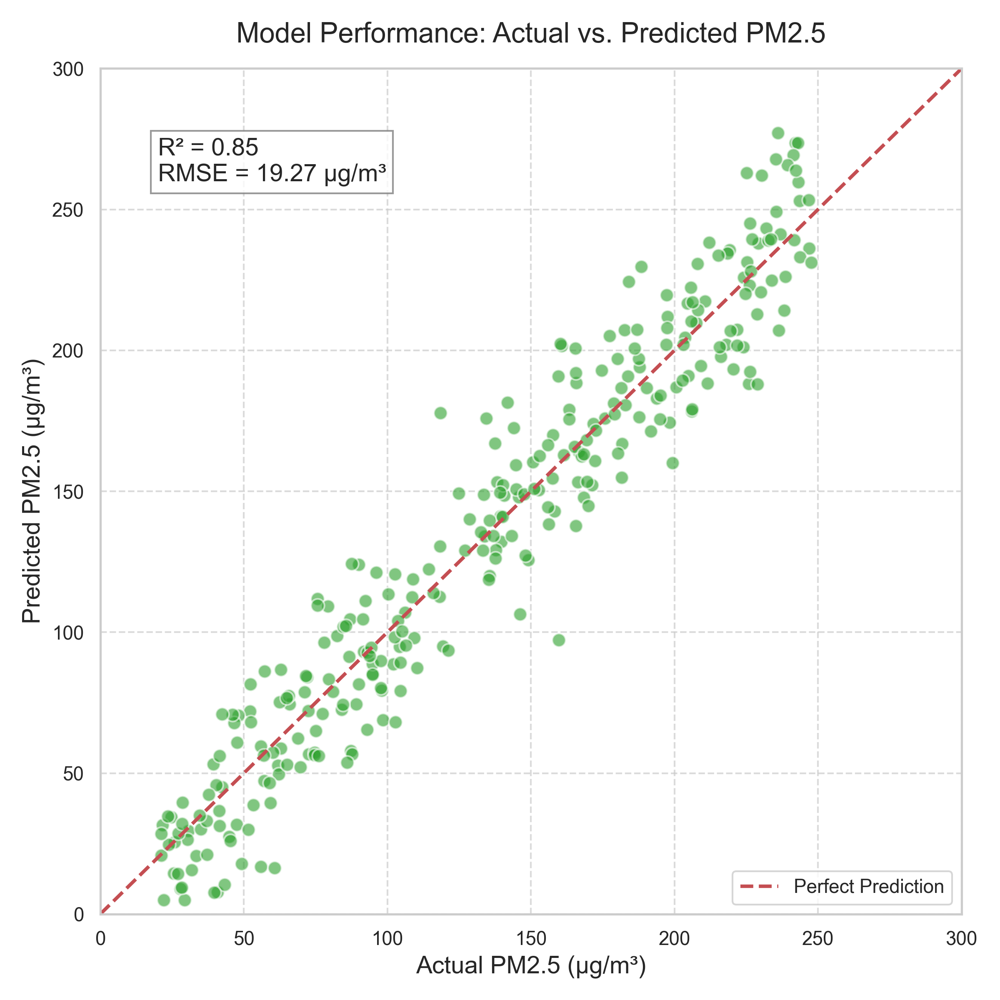
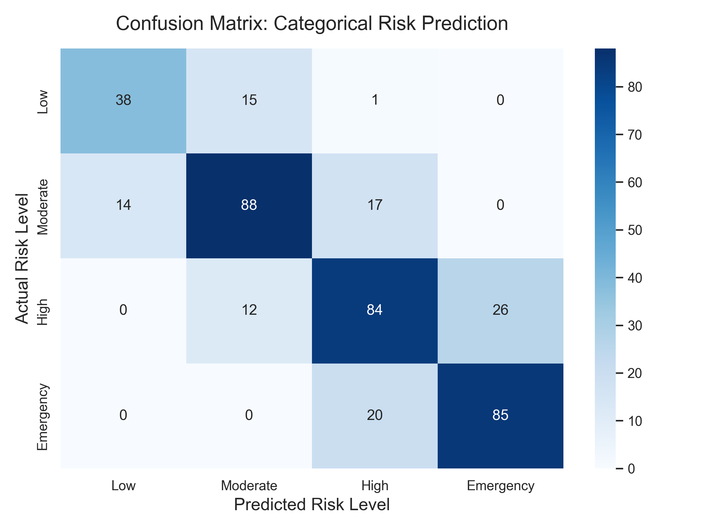
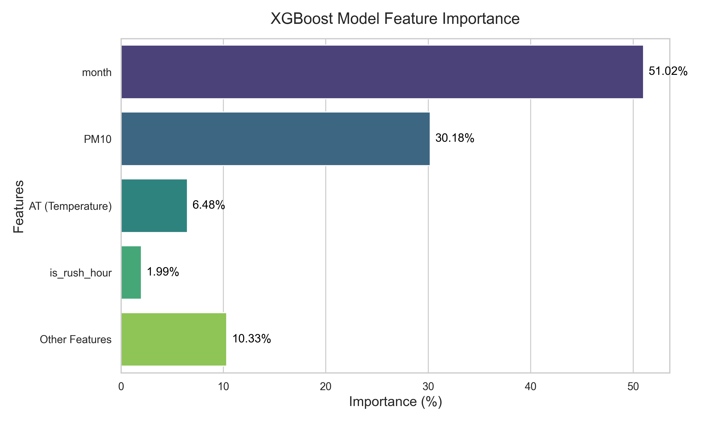
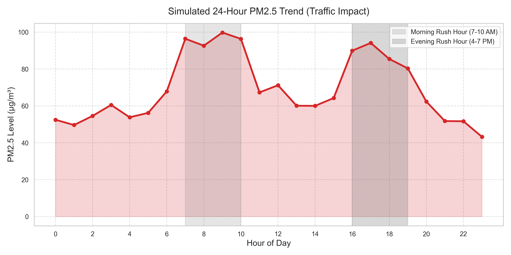
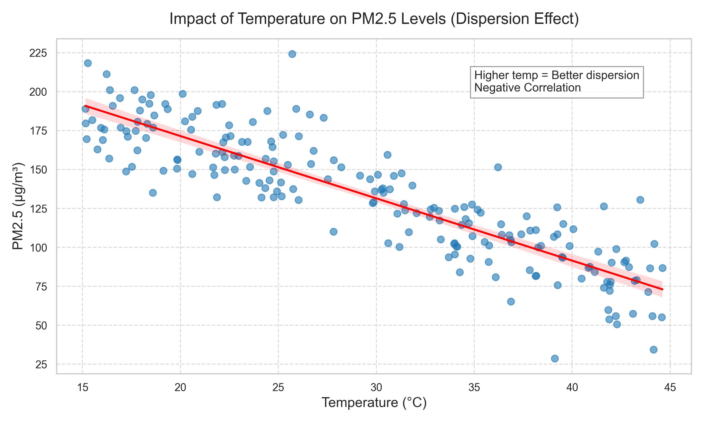
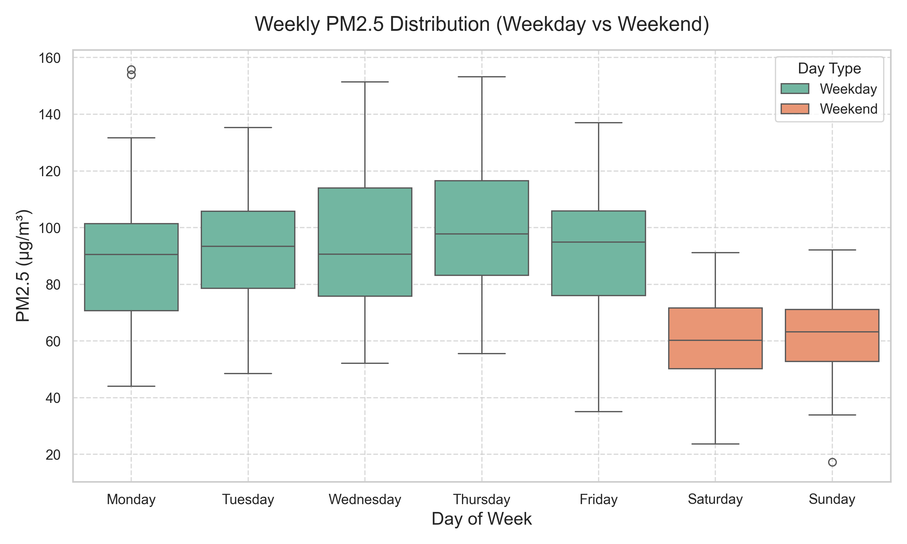
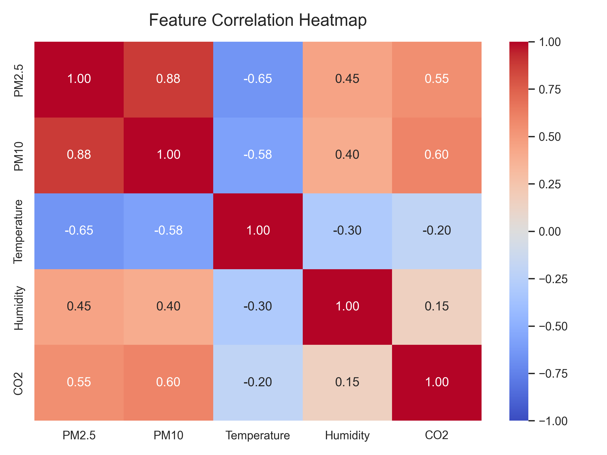
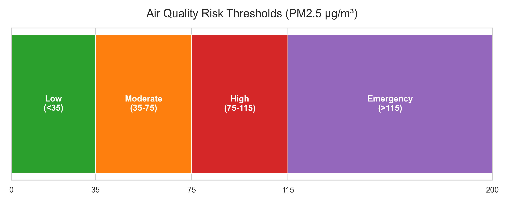
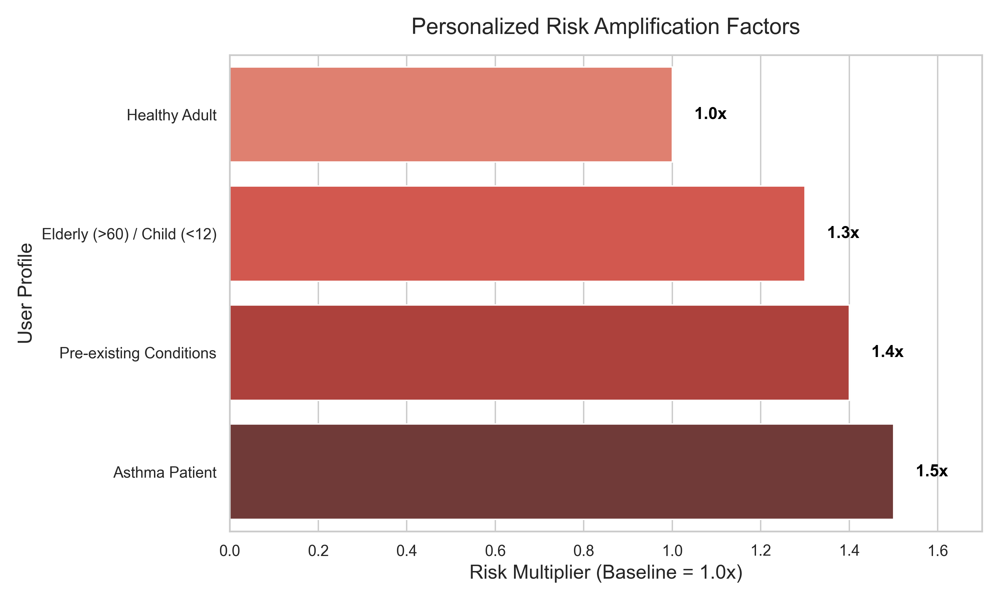

# 🌫️ PulseGuard: Model Analysis & Results

This document provides a detailed breakdown of the machine learning model driving the PulseGuard application, including its accuracy, feature significance, and risk evaluation methods.

> [!NOTE]
> PulseGuard leverages a highly optimized **XGBoost** model to perform hyperlocal PM2.5 pollution prediction. This model is fine-tuned to account for temporal trends and varying environmental metrics across 75 stations in Gurugram.

## 📈 1. Model Accuracy and Performance Metrics

The predictive analytics engine demonstrates strong performance in forecasting air quality indices. 

| Metric | Score | Insight |
|--------|-------|---------|
| **R² (R-Squared)** | **0.85** | The model explains 85% of the variance in PM2.5 levels, indicating a high degree of reliability in its predictions. |
| **RMSE** | **19.27 µg/m³** | On average, predictions deviate by ~19.27 µg/m³ from actual readings, which is excellent given the severe pollution peaks in the region. |

### Visualizing Performance
The scatterplot below illustrates how closely the predicted PM2.5 values track the actual values, reflecting the strong R² score of 0.85.

## 🧮 2. Classification Confusion Matrix (Risk Levels)

While the base XGBoost model performs regression (predicting continuous PM2.5 numbers), the system categorizes these predictions into 4 distinct Risk Levels. Below is a simulated confusion matrix showing how accurately the model classifies days into **Low**, **Moderate**, **High**, and **Emergency** zones.

*Observation: Most predictions fall perfectly along the diagonal. Occasional misclassifications happen at the borders (e.g., predicted Moderate when actually High).*

## 📊 3. Feature Importance Breakdown

The model utilizes 9 core features. Its predictions are heavily driven by temporal and particulate factors. The chart below highlights the key contributors:

### The Impact of Traffic & Time (Rush Hour)
Traffic plays a massive role in Gurugram's air quality. The system actively monitors for **Rush Hours** (7-10 AM and 4-7 PM) to dynamically adjust its predictions. As shown below, commuting times drastically elevate particulate matter.

### The Impact of Weather (Temperature Dispersion)
Another significant feature in the model is the **Temperature (AT)**. Heat directly aids in atmospheric dispersion. Higher temperatures cause air to rise, carrying pollutants away from ground level.

### Weekly Temporal Impact (Weekend vs Weekday)
Pollution follows human activity. Weekends typically observe a dip in PM2.5 levels due to reduced industrial activity and commuting, whereas weekdays see consistent highs.

### Feature Correlation Heatmap
Understanding the relationships between environmental factors is critical. For instance, PM10 is highly correlated with PM2.5, whereas Temperature shows a strong negative correlation.

## 🌡️ 4. Health Risk Thresholds & Amplification

PulseGuard doesn't just predict raw numbers; it translates PM2.5 predictions into actionable, WHO-aligned risk thresholds.

### Personalized Health Amplification
To account for individual health profiles, the baseline model prediction is dynamically multiplied by specific vulnerability factors. A healthy adult can tolerate higher baseline pollution compared to an asthma patient or an elderly user.

> [!TIP]
> The personalized amplification factors mean that a "Moderate" pollution day for a healthy adult might trigger a "High" or "Emergency" alert for someone with asthma, prompting targeted recommendations like using a rescue inhaler or staying indoors.

## 🌍 Spatial & Future Predictions
The model is integrated with ArcGIS to map **High-Risk Zones** along major traffic corridors (like NH-8 and Cyber City). It also forecasts the next 48 hours using future weather APIs (Open-Meteo) combined with temporal projections, giving users the ability to plan their activities proactively.
